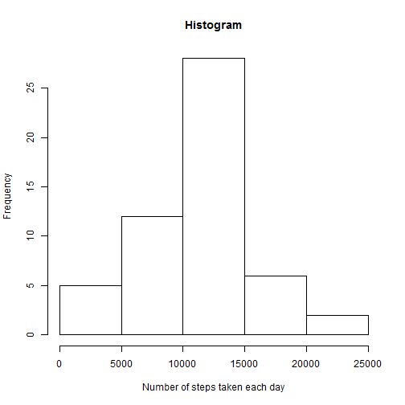
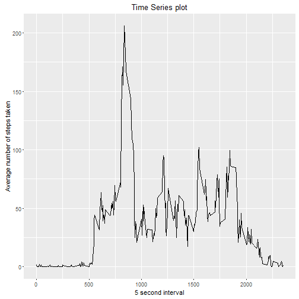
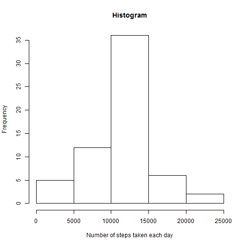
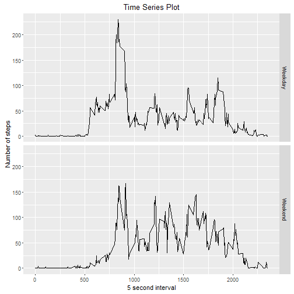

###Loading the data


```r
activity <- read.csv("./activity.csv")
```

###What is mean total number of steps taken per day?
Total number of steps taken per day

```r
stepsperday <- aggregate(steps ~ date, data = activity, sum)
head(stepsperday)
```

```
##         date steps
## 1 2012-10-02   126
## 2 2012-10-03 11352
## 3 2012-10-04 12116
## 4 2012-10-05 13294
## 5 2012-10-06 15420
## 6 2012-10-07 11015
```

Histogram of the total number of steps taken each day

```r
hist(stepsperday$steps,
     main = "Histogram", 
     xlab = "Number of steps taken each day",
     ylab = "Frequency")
```



Mean:

```r
mean(stepsperday$steps)
```

```
## [1] 10766.19
```

Median:

```r
median(stepsperday$steps)
```

```
## [1] 10765
```

###What is the average daily activity pattern?

Time Series Plot

```r
stepsperinterval <- aggregate(steps ~ interval, data = activity, mean)
library(ggplot2)
ggplot(stepsperinterval, aes(interval, steps)) + 
      geom_line() + 
      xlab("5 second interval") + 
      ylab("Average number of steps taken") +
      ggtitle("Time Series plot")
```



Finding the 5-minute interval that contains the maximum number of steps on average.

```r
maxinterval <- stepsperinterval$interval[which.max(stepsperinterval$steps)]
```
Interval 835, on average across all the days in the dataset, contains the maximum number of steps.

###Imputing missing values

Calculate number of NAs

```r
NAs <- sum(is.na(activity$steps))
```
The total number of rows with NAs is 2304

Create a new dataset and fill the missing values with the mean for that 5-minute interval

```r
activity_new <- activity

for (i in 1:length(activity[,1])) {
      if(is.na(activity_new$steps[i])) {
            activity_new$steps[i] <- round(stepsperinterval$steps[which(stepsperinterval$interval == activity$interval[i])])
      }
      else {
            activity_new$steps[i] <- activity$steps[i]
      }
      
}
```

Total number of steps taken per day

```r
stepsperday_new <- aggregate(steps ~ date, data = activity_new, sum)
head(stepsperday_new)
```

```
##         date steps
## 1 2012-10-01 10762
## 2 2012-10-02   126
## 3 2012-10-03 11352
## 4 2012-10-04 12116
## 5 2012-10-05 13294
## 6 2012-10-06 15420
```

Histogram of the total number of steps taken each day

```r
hist(stepsperday_new$steps,
     main = "Histogram", 
     xlab = "Number of steps taken each day",
     ylab = "Frequency")
```



Mean:

```r
mean(stepsperday_new$steps)
```

```
## [1] 10765.64
```

Median:

```r
median(stepsperday_new$steps)
```

```
## [1] 10762
```

The values differ in very little scale from the first part and the impact of imputing missing values on the estimates are very less.

###Are there differences in activity patterns between weekdays and weekends?
Creating a new factor variable in the dataset with two levels -- "weekday" and "weekend" indicating whether a given date is a weekday or weekend day.

```r
activity_new$date <- as.Date(activity_new$date)
activity_new$weekday <- 0
weekend <- which(weekdays(activity_new$date) == "Saturday" | weekdays(activity_new$date) == "Sunday")
activity_new$weekday[weekend] <- 1
activity_new$weekday <- factor(activity_new$weekday, levels = c(0, 1), labels = c("Weekday", "Weekend"))
```

Time Series plot to compare the pattern in the Number of steps between Weekends and Weekdays

```r
stepsperinterval_new <- aggregate(steps ~ interval + weekday, data = activity_new, mean)
qplot(interval, steps, data = stepsperinterval_new, 
      facets = weekday ~ ., 
      geom = "line",
      xlab = "5 second interval",
      ylab = "Number of steps",
      main = "Time Series Plot")
```


